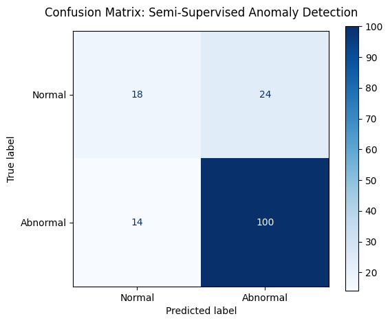
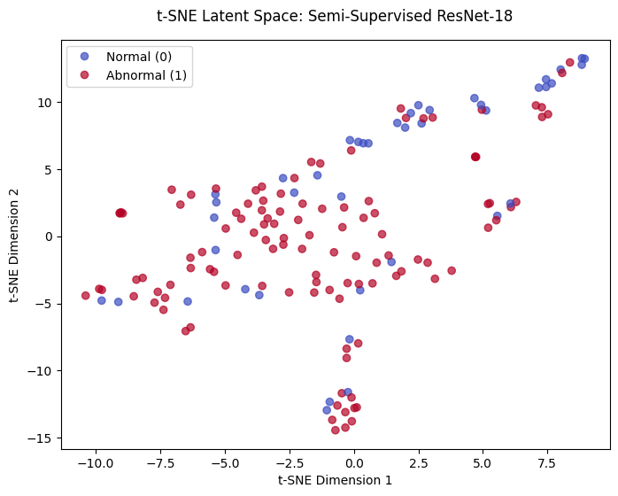
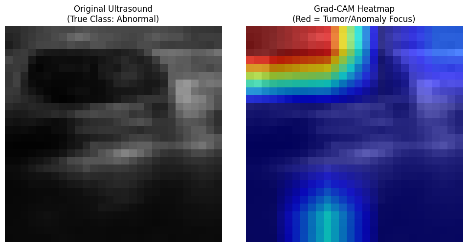

# Overcoming Data Scarcity in Medical Imaging: A Dual-Stream Semi-Supervised Approach to Breast Ultrasound Classification

**Author:** Laurentia Liennart (A17853835)  
**Institution:** University of California, San Diego  
**Courses:** COGS 181 (Deep Learning) & COGS 185 (Advanced Machine Learning)  

## 📌 Project Overview
Deep learning in computational radiology is fundamentally bottlenecked by data scarcity, as expert medical annotations are highly expensive and time-consuming to acquire. This project addresses this limitation by deploying a **dual-stream semi-supervised learning pipeline** to classify BreastMNIST ultrasound images. 

To simulate a realistic clinical constraint, the ground-truth annotations were artificially restricted to just **10% (N=54) of the training dataset**. The remaining **90% (N=492) of unannotated scans** were leveraged using advanced consistency regularization. By optimizing a ResNet-18 architecture with this dual-objective approach, the model demonstrates that bridging deep feature extraction with unsupervised consistency constraints effectively bypasses the costly medical annotation bottleneck.

## 🧠 Methodology
This project explicitly divides its scope into two distinct, rigorous machine learning paradigms:

### 1. Deep Feature Extraction (COGS 181 Scope)
- **Architecture:** Conducted comparative baseline experiments (LeNet vs. ResNet-18). Selected a **ResNet-18 CNN backbone** to prevent vanishing gradients while processing complex ultrasound textures. 
- **Optimization:** Tuned hyper-parameters (SGD vs. Adam), ultimately selecting the Adam optimizer (lr = 0.001) for maximum stability in a severely restricted data regime. The supervised objective minimizes standard Cross-Entropy Loss.

### 2. Consistency Regularization (COGS 185 Scope)
- **Semi-Supervised Algorithm:** Implemented a learning paradigm utilizing stochastic geometric augmentations (15-degree rotations and horizontal flips) on the unannotated data stream.
- **Custom Objective:** Balanced empirical risk (supervised) with structural consistency (unsupervised Mean Squared Error):  
  $L_{total} = L_{supervised} + \lambda_u L_{unsupervised}$
- **Tuning:** Rigorously tuned the consistency weight ($\lambda_u = 0.1, 0.5, 1.0$), finding that $\lambda_u = 1.0$ prevented overfitting and maximized test-set generalization.

## 📊 Clinical Results & Interpretability
The dual-stream pipeline successfully prioritized highly sensitive anomaly detection without the need for exhaustive ground-truth labeling.

* **High-Recall Diagnostic Threshold:** Achieved an **ROC-AUC of 0.7151** and a highly sensitive **tumor recall rate of 88%**. In clinical screening, minimizing False Negatives (missing a malignant tumor) is biologically and ethically critical, making this high-recall convergence highly desirable.
* **Latent Space Validation (t-SNE):** Dimensionality reduction of the 512-dimensional penultimate layer confirms the network successfully organized its internal latent space based on underlying tissue structures, forming distinct biological "neighborhoods".
* **Spatial Interpretability (Grad-CAM):** Extracted gradients from `layer2` to prevent spatial collapse on the aggressively down-sampled ($28\times28$ pixel) images, successfully visualizing and localizing anomalous anatomical boundaries.

### Visualizations
*(Note: Ensure your images are uploaded to an `images/` folder in your repository for these to display correctly.)*

  
*Figure 1: Confusion Matrix showcasing the 88% anomaly recall rate.*

  
*Figure 2: t-SNE dimensionality reduction of the 512-D feature vectors.*

  
*Figure 3: Grad-CAM spatial activation mapping targeting layer2.*

## 🚀 Limitations & Future Iterations
While the framework successfully extracted robust features, the MedMNIST images are aggressively down-sampled to $28\times28$ pixels, obscuring high-resolution clinical markers like micro-calcifications. 

Future iterations to push the boundaries of this automated screening tool include:
1. **Transitioning to high-resolution DICOM ultrasound images**.
2. **Explicitly hard-coding a "Cost-Sensitive Loss" function** during the supervised training phase to mathematically penalize False Negatives even further.
3. **Upgrading the learning paradigm** from basic MSE consistency to advanced frameworks like *FixMatch* (confidence thresholding) or *Mean Teacher* (exponential moving averages of model weights) to improve batch stability.

## ⚙️ Installation & Usage
To run this pipeline locally or in Google Colab:

1. Clone the repository:
   ```bash
   git clone [https://github.com/itslauhere/Semi-Supervised-Ultrasound-Classification.git](https://github.com/yourusername/Semi-Supervised-Ultrasound-Classification.git)
   ```

2. Install the required dependencies:
   ```bash
   pip install -r requirements.txt
   ```

3. Run the `COGS_181_185_Final_Project.ipynb` notebook. The MedMNIST dataset will automatically download via the PyTorch dataloader upon execution.